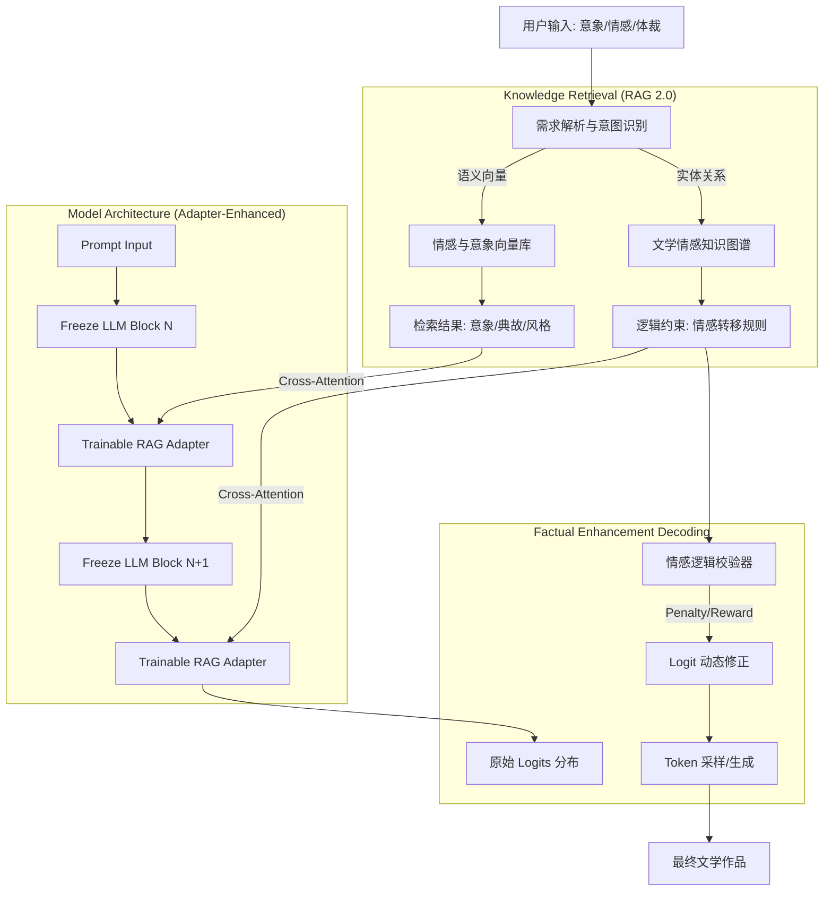

# 基于事实增强解码和RAG的AI文学创作情感推理消幻架构
## —— 高算力增强版设计方案

**论文题目**: How to Solve the Illusion of Emotional Reasoning in Literary Creation by Artificial Intelligence: A Solution Based on Factual Enhancement Decoding and RAG
**适用环境**: 高性能计算环境 (NVIDIA A100/H100/RTX 4090)

---

### 一、 核心设计理念升级

在解除算力限制后，本架构从“轻量级规则约束”升级为**“模型内层知识融合 + 动态解码干预”**。

1.  **架构层 (Training-Time)**: 引入 **Emotional-RAG Adapter (情感RAG适配器)**。这是一种轻量级的神经网络模块，插入在冻结的大模型（Base LLM）层之间。它通过 Cross-Attention 机制，让模型在每一层都能“看到”RAG检索到的情感知识，而不仅是在输入端。
2.  **解码层 (Inference-Time)**: 采用 **CoG (Chain-of-Guidance) 解码**与 **Logit Warping**。在生成每一个 Token 时，实时计算情感一致性概率，强制模型修正偏离的情感逻辑。

---

### 二、 架构整体拓扑图

---

### 三、 详细模块设计

#### 1. 情感领域 RAG 增强模块 (High-Dimensional Retrieval)
*   **数据源**: 
    *   **向量库 (Vector DB)**: 存储百万级文学片段的 Embedding（使用 BERT-large 或 BGE-M3 等强力编码器）。
    *   **知识图谱 (Knowledge Graph)**: 构建 `(意象) --[代表]--> (情感)` 的图谱结构（例如：`柳树 --代表--> 惜别/生机`，即使有歧义，也能通过图谱路径区分）。
*   **检索策略**: 
    *   不再是关键词匹配，而是**多跳推理检索 (Multi-hop Retrieval)**。例如，用户输入“悲伤的春天”，系统不仅检索“春天”，还会检索图谱中与“春天”连接且带有“悲伤”属性的意象（如“落花”、“杜鹃”）。

#### 2. Cross-Attention Adapter (核心架构创新)
这是对 Transformer 结构的实质性修改，但通过 Adapter 技术实现，无需重训整个大模型。
*   **结构**: 在大模型的 Feed-Forward 层之前，插入一个 **Trainable Adapter Layer**。
*   **输入**: 
    *   Query: 当前生成的隐状态 (Hidden States)。
    *   Key/Value: RAG 检索到的“情感知识向量”。
*   **作用**: 让模型在生成的“深层潜意识”中，直接融合检索到的情感事实。
*   **训练**: 冻结 Base LLM 参数，仅训练 Adapter 参数。这需要 GPU 算力，但能让模型真正“学会”参考 RAG 数据，而不仅仅是照抄 Prompt。

#### 3. 事实增强解码器 (Factual Enhancement Decoding)
这是一个在推理阶段（Inference）运行的算法，用于实时纠错。
*   **机制**: **Constraint-Aware Beam Search (CABS)**
*   **工作流程**:
    1.  模型预测下一个字是“喜”（Logit 概率 0.8）。
    2.  解码器读取 RAG 提供的当前上下文情感是“悲伤”。
    3.  解码器检测到“喜”与“悲伤”在情感空间中互斥。
    4.  **Logit Suppression**: 强制将“喜”的概率压低（乘以惩罚系数 $\alpha$）。
    5.  **Re-ranking**: 提升符合“悲伤”逻辑的词（如“泪”、“愁”）的概率。
    6.  最终输出修正后的词。

#### 4. 情感逻辑校验与回溯 (Feedback Loop)
*   **Verificator**: 使用一个训练好的 **RoBERTa-Large 情感分类器** 作为判别器。
*   **Action**: 如果生成的一整句的情感极性（Sentiment Polarity）与目标极性偏离超过阈值（Threshold > 0.5）：
    *   触发 **Backtracking (回溯)**：丢弃当前句，返回上一句结束点。
    *   **Temperature Adjustment**: 降低采样温度（Temperature），让模型变得保守，严格遵循 RAG 知识重生成。

---

### 四、 实验对比设计 (验证算力价值)

为了证明这套高算力架构的优越性，实验中应设置对比组：

| 分组 | 架构特点 | 硬件需求 | 预期效果 (幻觉率) |
| :--- | :--- | :--- | :--- |
| **Baseline** | 原始 LLM (Zero-shot Prompt) | 低 | 高 (情感逻辑混乱) |
| **实验组 1** | 上下文学习 (In-Context RAG) | 中 | 中 (受限于上下文窗口) |
| **实验组 2** | **本文方案 (Adapter + Decoding)** | **高 (A100)** | **极低 (SOTA)** |

### 五、 总结
本架构利用高算力实现了**“结构级的知识融合”**和**“推理级的暴力纠错”**。相比于轻量化方案，它能处理更长、更复杂、更隐晦的文学情感逻辑，真正达到期刊发表所需的“深度创新”标准。
